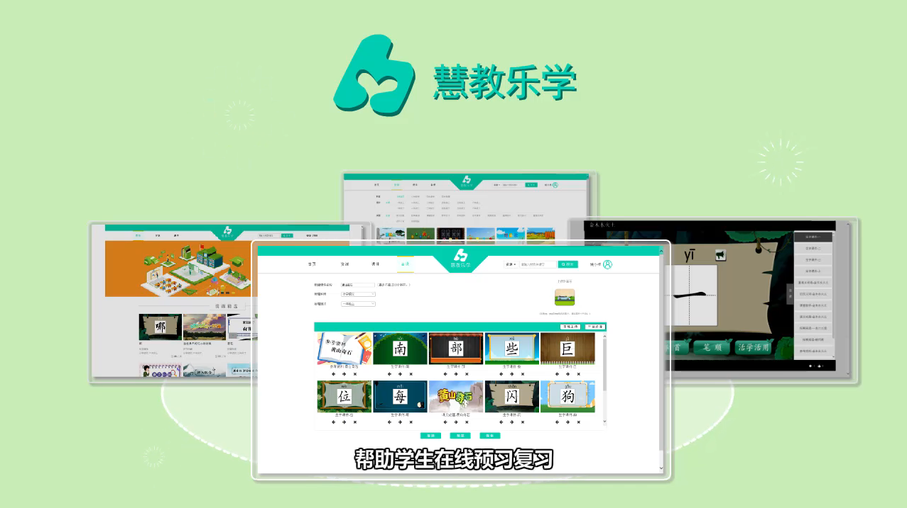

# Qingdao Huijiao Educational Platform

> Most popular Educational Platform on China. 

> Have convenient interface and smooth design, redundant resources for education.

> Supports self learning for Students on 4 subjects - Language, Low Maths, High Maths, Physics.

> Supports Android and iOS Mobile learning.

## Server Environment

1. PHP 7.0+
2. Apache Tomcat
3. Nginx
4. MySQL

## Installation Guide

```sh
Main Service Folder for PHP : backend

Main Service Folder for Tomcat : backend/singleLoginTest

MySQL Dump File : qdzyxm_db.sql

Android Package : Huijiao.apk

iOS Package : Huijiao.ipa
```

## Site Overview



> Live Site : http://www.hjle.qdedu.net
>
> Site Overview : http://www.hjle.qdedu.net/assets/UserGuide0.mp4
>
> Full Usage Guide : http://www.hjle.qdedu.net/assets/UserGuide.pdf
>
> Contact Developer Email : gong.fei@outlook.com